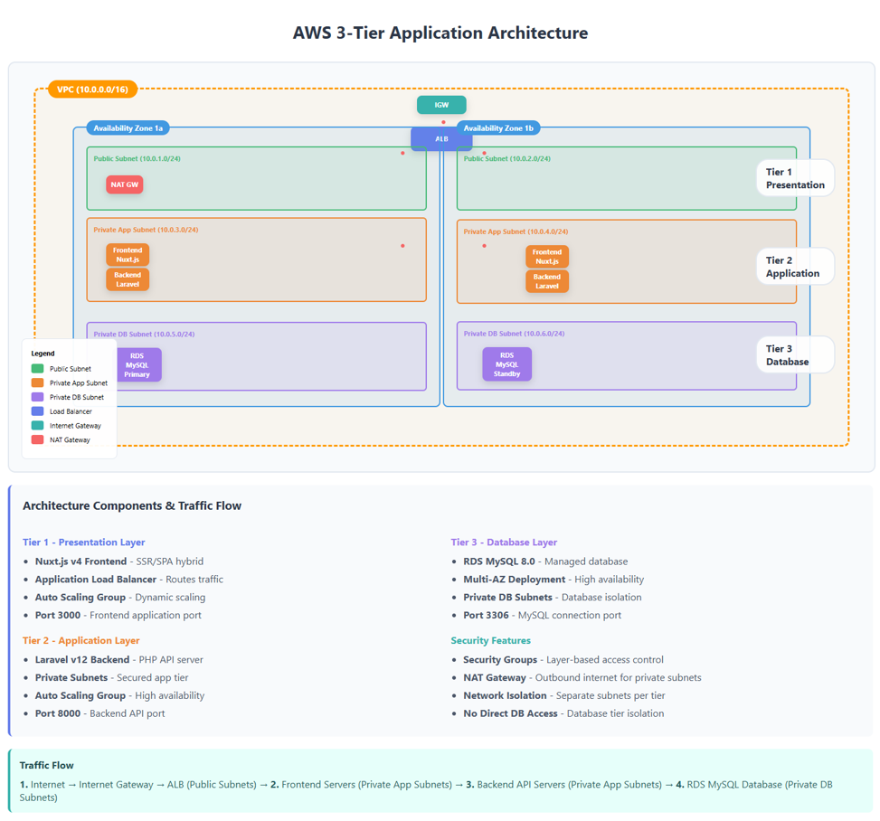
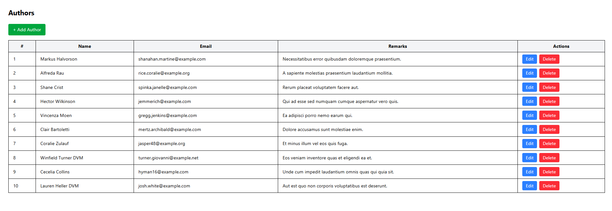
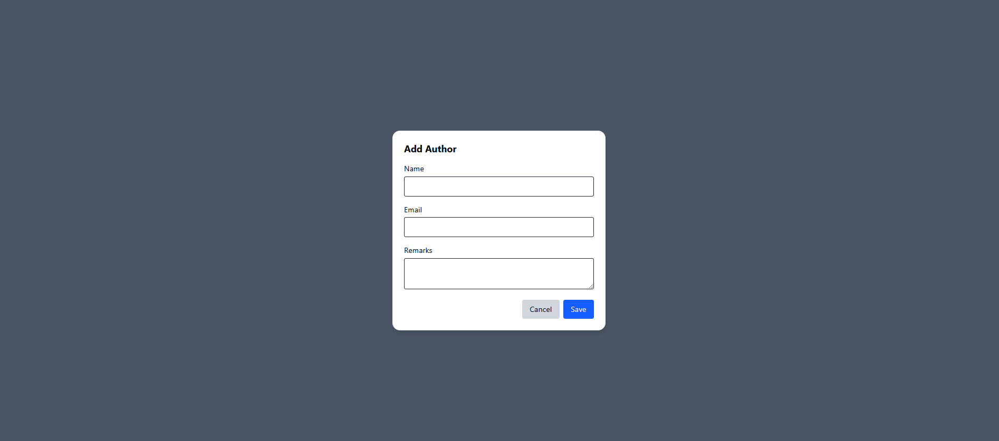
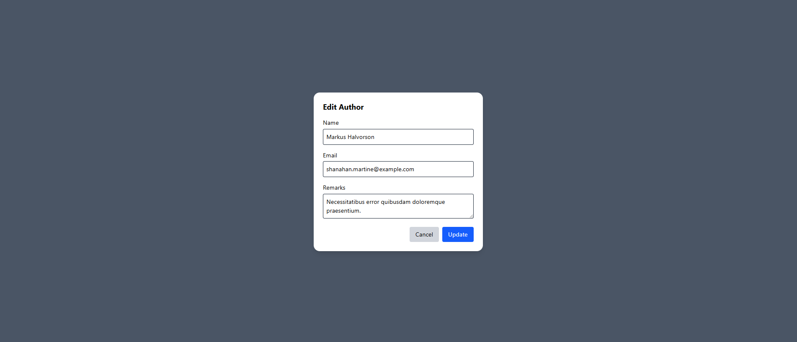
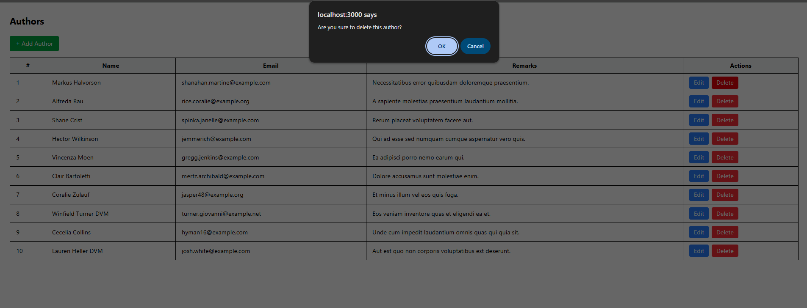
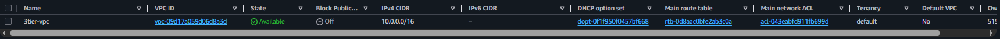
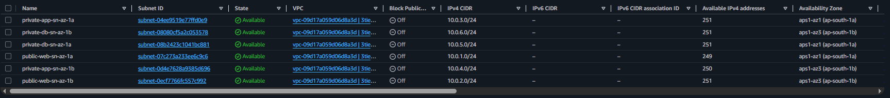
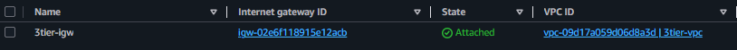
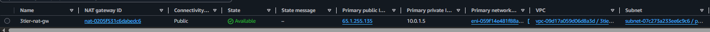

# AWS 3-Tier Architecture
### Deploy a 3-tier architecture on AWS: Frontend (Nuxt.js), Backend (Laravel), and Database (MySQL).

## Architecture Overview

## Frontend View (Author List, Create, Edit, Delete)

## VPC & Subnet
- vpc-cidr-block: 10.0.0.0/16 
#### Subnets
- public(frontend)-subnet-1-cidr-block: 10.0.1.0/24
- public(frontend)-subnet-2-cidr-block: 10.0.2.0/24
- private(backend)-subnet-1-cidr-block: 10.0.3.0/24
- private(backend)-subnet-2-cidr-block: 10.0.4.0/24
- private(db)-subnet-1-cidr-block: 10.0.5.0/24
- private(db)-subnet-2-cidr-block: 10.0.6.0/24

## Internet Gateway & NAT Gateway

## Frontend Dependency
- Nginx
- git
- nodejs & npm

## Backend Dependency
- Apache
- git
- nodejs & npm (not mandatory)
- php
- mysql
- composer